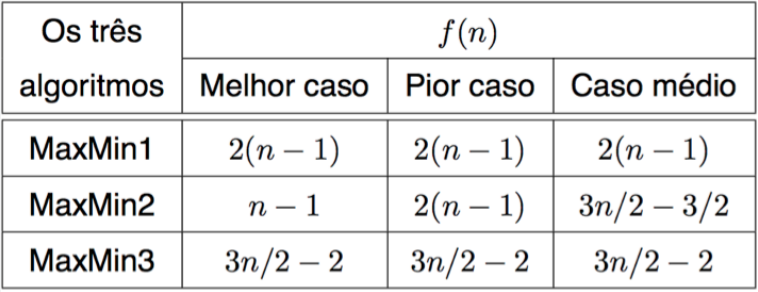

# Proposta do Trabalho

O objetivo do trabalho é fazer um jogo na qual consiste que um personagem percorra um labirinto construído por diversas matrizes, das quais possui as seguintes regras:
- O jogo termina quando o personagem perde toda a vida (possui um total de 10 de vida).
- Possui paredes durante o caminho que são representadas por ```#```, que são locais onde o personagem não pode caminhar.
- Possui caminhos chamados de perigo, representados por ```*```, que são locais onde o personagem perde uma vida cada vez que passa por ele.

# O Algoritmo
```INPUT```

```OUTPUT```

# Custo Computacional

Para avaliar o custo computacional de um algoritmo ou estrutura de dados, é comum usar a notação assintótica, que descreve a complexidade em termos de como ela cresce em relação ao tamanho dos dados de entrada. As notações mais comuns são O (grande O), Ω (ômega) e Θ (teta). Por exemplo, um algoritmo O(n²) significa que o tempo de execução cresce quadráticamente em relação ao tamanho dos dados de entrada (n). Já um algoritmo O(nlogn) significa que o tempo de execução cresce logaritmicamente em relação ao tamanho dos dados de entrada.

Para exemplicar os custos computacionais, será utilizado como base os algoritmos MaxMin1, MaxMin2 e MaxMin3. A proposta de cada um deles é encontrar o valor máximo e mínimo de um conjunto de números.

O algoritmo MaxMin1 faz duas passagens no conjunto de números, uma para encontrar o máximo e outra para encontrar o mínimo. Seu custo computacional é de O(n), onde n é o tamanho do conjunto.

Já o algoritmo MaxMin2 utiliza a técnica de divisão e conquista, onde divide o conjunto em duas partes iguais, encontra o máximo e o mínimo em cada parte e depois compara os resultados para encontrar o máximo e mínimo global. Seu custo computacional é de O(n log n).

Por fim, o algoritmo MaxMin3 utiliza um método de pares, onde os elementos do conjunto são agrupados em pares, o máximo e mínimo de cada par são comparados e o maior e menor valor é comparado com o máximo e mínimo globais. Seu custo computacional também é de O(n).

No melhor caso, todos os algoritmos têm o mesmo desempenho, pois é necessário percorrer todo o conjunto para encontrar o máximo e mínimo. No pior caso, o algoritmo MaxMin2 é o mais eficiente, pois seu custo computacional é menor que o dos outros algoritmos. No caso médio, o algoritmo MaxMin3 é o mais eficiente, pois tem um custo computacional constante em relação ao tamanho do conjunto.

<p align="center">

</p>
<p align="center">
<em>Imagem 1: Tabela dos casos de MinMax1, MinMax2 e MinMax3. </em>

</p>

Outra maneira de identificar os custos computacionais das notações assintóticas, é a representação gráfica, apresentada na imagem 2.
Em resumo, ```O (grande O)```, no gráfico, representa o pior caso. Isso ocorre porque ele estabelece um limite superior de tempo de execução para o algoritmo. Isso significa que, para entradas maiores, o tempo de execução ou tempo de acesso nunca excederá o limite superior estabelecido por O. Para o ```Ω (ômega)```, é representado o melhor caso. Ele estabelece um limite inferior para o tempo de execução do algoritmo. Isso significa que, para entradas menores, o tempo de execução ou tempo de acesso nunca será menor do que o limite inferior estabelecido por Ω. Por último, o ```Θ (teta)``` representa o caso médio. Ele estabelece um limite justo para o tempo de execução do algoritmo. Isso significa que, para entradas de tamanho moderado, o tempo de execução ou tempo de acesso será igual ao limite estabelecido por Θ. 

</p>

<p align="center">

</p>
<p align="center">
<em>Imagem 2: Representação gráfica dos três casos. </em>

</p>

- Qual o custo computacional da sua estratégia randômica? 

- Se mostrou uma boa alternativa de execução?

# Compilação e Execução

O algoritmo disponibilizado possui um arquivo Makefile que realiza todo o procedimento de compilação e execução. Para tanto, temos as seguintes diretrizes de execução:

<div>

| Comando                |  Função                                                                                           |
| -----------------------| ------------------------------------------------------------------------------------------------- |
|  `make clean`          | Apaga a última compilação realizada contida na pasta build                                        |
|  `make`                | Executa a compilação do programa utilizando o gcc, e o resultado vai para a pasta build           |
|  `make run`            | Executa o programa da pasta build após a realização da compilação                                 |

</div>
