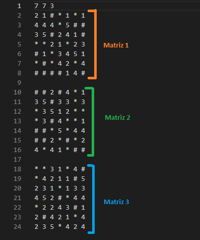
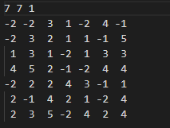
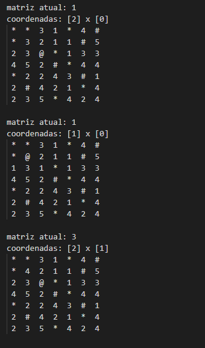
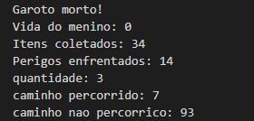

# Proposta do Trabalho

O objetivo do trabalho é fazer um jogo na qual consiste que um personagem percorra um labirinto construído por diversas matrizes, das quais possui as seguintes regras:
- O jogo termina quando o personagem perde toda a vida (possui um total de 10 de vida).
- Possui paredes durante o caminho que são representadas por ```#```, que são locais onde o personagem não pode caminhar.
- Possui caminhos chamados de perigo, representados por ```*```, que são locais onde o personagem perde uma vida cada vez que passa por ele.

# O Algoritmo
```INPUT```

A proposta do trabalho consiste na leitura de três matrizes que formam o labirinto que será percorrido. A ideia principal é de que o personagem consiga todas as matrizes até que o jogo acabe. 

Além das regras propostas pelo trabalho, foi incrementado outras regras, das quais são elas: (a) existem um portal do lado esquerdo e direito; (b) o loop só vai parar quando o personagem morrer; (c) o jogo vai acabar quando o personagem percorrer todas as matrizes; (c) o personagem só avançará para a próxima matriz quando avançar pelos portais ou quando bater na parede, que será jogado automaticamente para outra matriz.

O input do algoritmo consiste em fazer, primeiramente, a leitura das matrizes que formam o labirinto. Após a leitura do arquivo, existem outras funções necessárias para atender os requisitos do trabalho. Abaixo estão as funções utilizadas para fazer tal verificação:

- ```void fazCopia(copiaCheckpoint *matriz):``` Função responsável por fazer a cópia da matriz do checkpoint, mantendo as paredes e os perigos existentes. Inicialmente, para indicar se o garoto não passou pelo caminho, o valor será igual a zero. Caso tenha passado pelo caminho, o valor será igual a 1 e, então, mudará o arquivo cópia.

- ```void checkpoint(readMatriz *matriz):``` Função responsável por fazer o backup do arquivo das matrizes originais (input.data). 

- ```void leitura(readMatriz *matriz, int t, copiaCheckpoint *copia):``` Função responsável para fazer a leitura do arquivo original (input.data). Também faz a conversão dos símbolos de parede (#) e perigo (*) para -1 e -2, respectivamente. Essa conversão será exibida no arquivo do checkpoint, arquivo do qual será editado sempre que o algoritmo for compilado.

- ```void readCheckpoint(readMatriz *matriz):``` Função responsável por fazer o checkpoint da matriz original, na qual irá ser criado três arquivos, cada um desses arquivos contendo a alteração da matriz original e salvando-a.

- ```void readCopiaCheckpoint(copiaCheckpoint *matriz): ``` Função responsável por fazer a leitura da cópia do checkpoint. Ou seja, irá abrir o arquivo contendo todas as informações copiadas.

- ```void tamanho(int *linha, int *coluna, int *total): ``` Função responsável para definir o tamanho da matriz.

- ```void output(int x, int y, readMatriz*matriz): ``` Função responsável para a criação de outro arquivo na qual mostrará o caminho impresso percorrido pelo menino.

- ```void relatorio(infoMenino*menino): ``` Função responsável apenas para mostrar as informações do menino, na qual ao final do processo, será impresso o resultado de todo o caminho percorrido.

- ```void readMatrizPercorrida(int *caminhoPercorrido, int *caminhoNaoPercorrido, int quantMatriz):```  Função responsável para mostrar se o garoto percorreu o caminho ou não. Para tal, foi criada uma condição para verificar, onde se o convert (variável encarregada da tokenização) for igual a zero, então o caminho não foi percorrido. Se o convert for igual a 1, o caminho será percorrido.

Para fazer a movimentação do menino, foi utilizada uma estrutura de switch, onde cada case, de 1 até o 8, representa um lado para qual ele irá de mover, de forma randômica. 

- ```Case 1:``` mover para direita
- ```Case 2:``` mover para esquerda
- ```Case 3:``` mover para baixo
- ```Case 4:``` mover para cima
- ```Case 5:``` mover para diagonal superior esquerda
- ```Case 6:``` mover para diagonal superior direita
- ```Case 7:``` mover para diagonal inferior esquerda
- ```Case 8:``` mover para diagonal inferior direita

Com a lógica das paredes e perigos, existem duas condições para fazer essa verificação. A primeira condição serve para verificar se existe uma parede no local (-1), verificando se a variável auxiliar é igual à variável responsável pela linha(x), caso essa verificação seja correspondida, o menino irá avançar para a próxima matriz. Já a segunda condição, serve para verificar se existe um perigo no local (-2), caso o menino passe por esse local, sua vida é decrementada e ele avançará para a próxima coordenada dentro da mesma matriz.


```OUTPUT```

Ao final do algoritmo, será impresso os resultados através dos arquivos que foram criados ao longo da compilação da matriz percorrida. Para cada resultado, será criado um arquivo, dentre eles estarão o ```output.data```, responsável por imprimir todas as matrizes percorridas pelo menino, o ```relatorio.data```, responsável por imprimir a quantidade de vida do menino, os itens coletados, os perigos enfrentados, a quantidade de matrizes, quantos caminhos foram percorridos e quantos não foram percorridos.

- Exemplo de execução

<center>
<table>
   <tr>
      <td>Input</td>
      <td>Checkpoint</td>
      <td>Output</td>
      <td>Relatório</td>
   </tr>
   <tr>
      <td></td>
      <td></td>
      <td></td>
      <td></td>
   </tr>
</table>
</center> 

# Custo Computacional

Para avaliar o custo computacional de um algoritmo ou estrutura de dados, é comum usar a notação assintótica, que descreve a complexidade em termos de como ela cresce em relação ao tamanho dos dados de entrada. As notações mais comuns são O (grande O), Ω (ômega) e Θ (teta). Por exemplo, um algoritmo O(n²) significa que o tempo de execução cresce quadráticamente em relação ao tamanho dos dados de entrada (n). Já um algoritmo O(nlogn) significa que o tempo de execução cresce logaritmicamente em relação ao tamanho dos dados de entrada.

Para exemplicar os custos computacionais, será utilizado como base os algoritmos ```MaxMin1, MaxMin2 e MaxMin3```. A proposta de cada um deles é encontrar o valor máximo e mínimo de um conjunto de números.
O algoritmo ```MaxMin1``` faz duas passagens no conjunto de números, uma para encontrar o máximo e outra para encontrar o mínimo. Seu custo computacional é de O(n), onde n é o tamanho do conjunto.
Já o algoritmo ```MaxMin2``` utiliza a técnica de divisão e conquista, onde divide o conjunto em duas partes iguais, encontra o máximo e o mínimo em cada parte e depois compara os resultados para encontrar o máximo e mínimo global. Seu custo computacional é de O(n log n).
Por fim, o algoritmo ```MaxMin3``` utiliza um método de pares, onde os elementos do conjunto são agrupados em pares, o máximo e mínimo de cada par são comparados e o maior e menor valor é comparado com o máximo e mínimo globais. Seu custo computacional também é de O(n).
No melhor caso, todos os algoritmos têm o mesmo desempenho, pois é necessário percorrer todo o conjunto para encontrar o máximo e mínimo. No pior caso, o algoritmo MaxMin2 é o mais eficiente, pois seu custo computacional é menor que o dos outros algoritmos. No caso médio, o algoritmo MaxMin3 é o mais eficiente, pois tem um custo computacional constante em relação ao tamanho do conjunto.

</p>

<p align="center">

</p>
<p align="center">
<em>Imagem 2: Tabela dos casos de MinMax1, MinMax2 e MinMax3. </em>

</p>

Outra maneira de identificar os custos computacionais das notações assintóticas, é a representação gráfica, apresentada na imagem 2. 
Em resumo, ```O (grande O)```, no gráfico, representa o pior caso. Isso ocorre porque ele estabelece um limite superior de tempo de execução para o algoritmo. Isso significa que, para entradas maiores, o tempo de execução ou tempo de acesso nunca excederá o limite superior estabelecido por O. Para o ```Ω (ômega)```, é representado o melhor caso. Ele estabelece um limite inferior para o tempo de execução do algoritmo. Isso significa que, para entradas menores, o tempo de execução ou tempo de acesso nunca será menor do que o limite inferior estabelecido por Ω. Por último, o ```Θ (teta)``` representa o caso médio. Ele estabelece um limite justo para o tempo de execução do algoritmo. Isso significa que, para entradas de tamanho moderado, o tempo de execução ou tempo de acesso será igual ao limite estabelecido por Θ. 

</p>

<p align="center">

</p>
<p align="center">
<em>Imagem 3: Representação gráfica dos três casos. </em>

</p>

Contudo, para este trabalho, o custo computacional não poderá ser previsto. Isso ocorre porque as condições utilizadas são de forma randômica. Isso pode ser explicado pela probabilidade de Bernoulli, um conceito matemático para representar eventos que têm apenas dois resultados possíveis: sucesso ou fracasso. Em outras palavras, é uma medida de probabilidade para eventos que têm uma distribuição binomial, ou seja, eventos que só podem ter dois resultados possíveis. Um exemplo simples dessa probabilidade seria o jogo de cara ou coroa, em que você joga uma moeda e espera que ela caia com a face desejada. Se você apostar em "cara", o sucesso seria a moeda cair com a face para cima, e o fracasso seria a moeda cair com a face para baixo.

<p align="center">

</p>
<p align="center">
<em>Imagem 4: Jogo cara e coroa. </em>

</p>

# Conclusão

Com este algoritmo, podemos entender melhor sobre os conceitos de alocação dinâmica de matrizes, seu custo computacional, espaço de memória. Diante disso, é observado em como utilizar vários conceitos relacionados à matriz pode aumentar a noção de programação que, futuramente, poderá ser usada em outros projetos, principalmente em relação à área de jogos.

# Compilação e Execução

O algoritmo disponibilizado possui um arquivo Makefile que realiza todo o procedimento de compilação e execução. Para tanto, temos as seguintes diretrizes de execução:

<div>

| Comando                |  Função                                                                                           |
| -----------------------| ------------------------------------------------------------------------------------------------- |
|  `make clean`          | Apaga a última compilação realizada contida na pasta build                                        |
|  `make`                | Executa a compilação do programa utilizando o gcc, e o resultado vai para a pasta build           |
|  `make run`            | Executa o programa da pasta build após a realização da compilação                                 |

</div>
