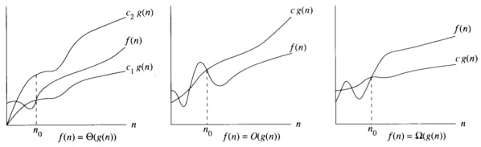

# Proposta do Trabalho

O objetivo do trabalho é fazer um jogo na qual consiste que um personagem percorra um labirinto construído por diversas matrizes, das quais possui as seguintes regras:
- O jogo termina quando o personagem perde toda a vida (possui um total de 10 de vida).
- Possui paredes durante o caminho que são representadas por ```#```, que são locais onde o personagem não pode caminhar.
- Possui caminhos chamados de perigo, representados por ```*```, que são locais onde o personagem perde uma vida cada vez que passa por ele.

# O Algoritmo
```INPUT```

```OUTPUT```

# Custo Computacional

Para avaliar o custo computacional de um algoritmo ou estrutura de dados, é comum usar a notação assintótica, que descreve a complexidade em termos de como ela cresce em relação ao tamanho dos dados de entrada. As notações mais comuns são O (grande O), Ω (ômega) e Θ (teta). Por exemplo, um algoritmo O(n^2) significa que o tempo de execução cresce quadráticamente em relação ao tamanho dos dados de entrada (n). Já um algoritmo O(nlogn) significa que o tempo de execução cresce logaritmicamente em relação ao tamanho dos dados de entrada.


<p align="center">

</p>
<p align="center">
<em>Imagem 1: Tabela dos casos de MinMax1, MinMax2 e MinMax3. </em>

</p>


O (grande O): O gráfico de O representa o pior caso do algoritmo ou estrutura de dados. Ele estabelece um limite superior de tempo de execução para o algoritmo ou tempo de acesso para a estrutura de dados. Isso significa que, para entradas maiores, o tempo de execução ou tempo de acesso nunca excederá o limite superior estabelecido por O. O gráfico de O cresce rapidamente e pode ser usado para identificar algoritmos ou estruturas de dados que não são adequados para grandes entradas.

Ω (ômega): O gráfico de Ω representa o melhor caso do algoritmo ou estrutura de dados. Ele estabelece um limite inferior para o tempo de execução do algoritmo ou tempo de acesso para a estrutura de dados. Isso significa que, para entradas menores, o tempo de execução ou tempo de acesso nunca será menor do que o limite inferior estabelecido por Ω. O gráfico de Ω é usado para identificar algoritmos ou estruturas de dados que são adequados para entradas pequenas.

Θ (teta): O gráfico de Θ representa o caso médio do algoritmo ou estrutura de dados. Ele estabelece um limite justo para o tempo de execução do algoritmo ou tempo de acesso para a estrutura de dados. Isso significa que, para entradas de tamanho moderado, o tempo de execução ou tempo de acesso será igual ao limite estabelecido por Θ. O gráfico de Θ é usado para identificar algoritmos ou estruturas de dados que são adequados para entradas moderadas.

</p>

<p align="center">

</p>
<p align="center">
<em>Imagem 2: Representação gráfica dos três casos. </em>

</p>

- Qual o custo computacional da sua estratégia randômica? 

- Se mostrou uma boa alternativa de execução?

# Compilação e Execução

O algoritmo disponibilizado possui um arquivo Makefile que realiza todo o procedimento de compilação e execução. Para tanto, temos as seguintes diretrizes de execução:

<div>

| Comando                |  Função                                                                                           |
| -----------------------| ------------------------------------------------------------------------------------------------- |
|  `make clean`          | Apaga a última compilação realizada contida na pasta build                                        |
|  `make`                | Executa a compilação do programa utilizando o gcc, e o resultado vai para a pasta build           |
|  `make run`            | Executa o programa da pasta build após a realização da compilação                                 |

</div>
